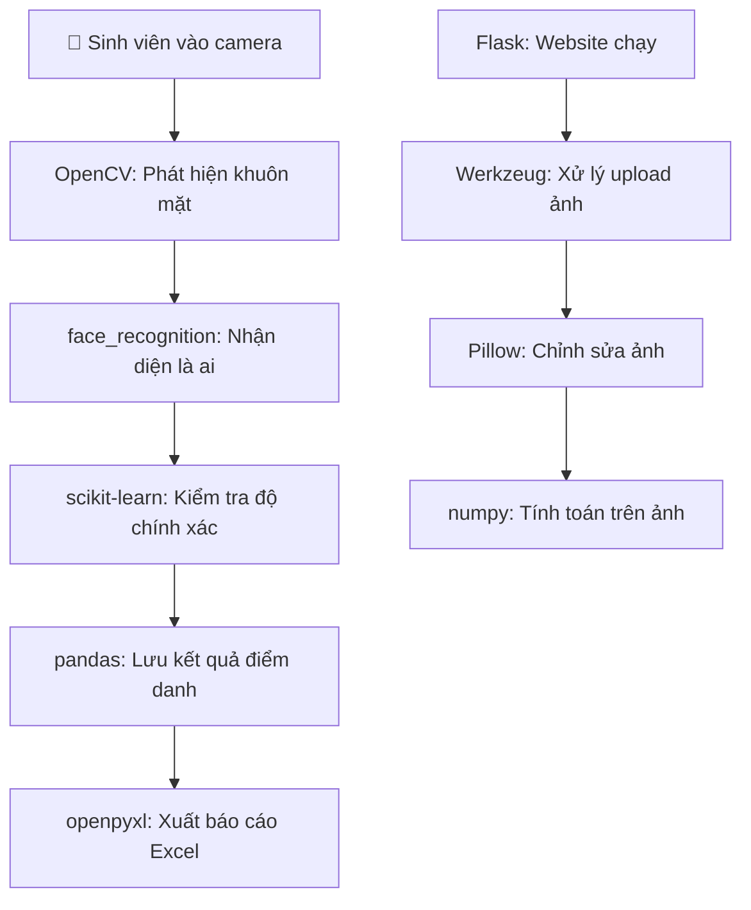

# 🎯 Hệ thống Điểm danh Khuôn mặt - Báo cáo Chi tiết

**Môn học:** Thị Giác Máy Tính  
**Lớp:** DA21TTA  
**Chuyên ngành:** Công nghệ thông tin  
**Giảng viên:** Đoàn Phước Miền  
**Nhóm Thực hiện:** Trần Bá Hiếu, Sĩ Chí Thiện, Phan Minh Thứ  
**Ngày cập nhật:** 03/07/2025

## 📋 Mục lục

- [Tổng quan](#tổng-quan)
- [Thư viện sử dụng và Công dụng](#thư-viện-sử-dụng-và-công-dụng)
- [Cấu trúc thư mục và chức năng từng file](#cấu-trúc-thư-mục-và-chức-năng-từng-file)
- [Database Schema](#database-schema)
- [API Endpoints](#api-endpoints)
- [Luồng hoạt động](#luồng-hoạt-động)
- [Tính năng bảo mật](#tính-năng-bảo-mật)
- [Hướng dẫn sử dụng](#hướng-dẫn-sử-dụng)
- [Troubleshooting](#troubleshooting)
- [Thư viện sử dụng và Công dụng](#thư-viện-sử-dụng-và-công-dụng)

## 🚀 Tổng quan

Hệ thống điểm danh sinh viên sử dụng công nghệ nhận diện khuôn mặt, được phát triển bằng Python Flask với SQLite database. Hệ thống hỗ trợ quản lý lớp học, sinh viên, môn học, tạo ca điểm danh và xuất báo cáo Excel với độ chính xác cao.

### ✨ Điểm nổi bật

- **🤖 AI Recognition**: Multiple algorithms (OpenCV, face_recognition, Advanced AI)
- **⚡ Real-time Processing**: Xử lý video stream thời gian thực từ webcam
- **📊 Advanced Analytics**: Dashboard thống kê và báo cáo chi tiết
- **🔐 Security**: Session-based authentication với route protection
- **📱 Responsive UI**: Bootstrap 5 với mobile-friendly design
- **📈 Excel Export**: Xuất báo cáo điểm danh theo môn học với format chuyên nghiệp
- **🎥 Auto Attendance**: Chế độ điểm danh tự động liên tục

## 📁 Cấu trúc thư mục và chức năng từng file

### 📄 ROOT FILES

#### `app.py` - 🎯 File Chính Flask Application

**Chức năng**: Entry point của toàn bộ ứng dụng, khởi tạo Flask app và quản lý routing chính
**Các tính năng chi tiết**:

- Cấu hình Flask app với secret key, upload/export folders
- Decorator `@login_required` để bảo vệ tất cả routes quan trọng
- Import và đăng ký blueprints từ thư mục `routes/`
- Route chính `/` kiểm tra session và redirect login nếu chưa đăng nhập
- API `/api/detect_face` cho nhận diện khuôn mặt real-time từ camera
- API `/api/capture_student_face` thu thập và lưu dữ liệu khuôn mặt sinh viên
- API `/api/subjects_by_class/<class_id>` lấy danh sách môn học theo lớp
- Khởi tạo OpenCV face detector và advanced AI model
- Xử lý upload file với security checks và serve static files
- Session management và authentication middleware

#### `attendance_system.db` - 🗄️ SQLite Database

**Chức năng**: Database chính lưu trữ toàn bộ dữ liệu hệ thống
**Cấu trúc bảng**:

- `classes`: Thông tin lớp học (id, class_code, class_name, description, created_at)
- `students`: Thông tin sinh viên (id, student_id, full_name, class_id, photo_path, face_encoding, created_at)
- `subjects`: Thông tin môn học (id, subject_code, subject_name, description, created_at)
- `attendance_sessions`: Ca điểm danh (id, session_name, subject_id, class_id, session_date, start_time, end_time, status, created_at)
- `attendance_records`: Bản ghi điểm danh (id, session_id, student_id, attendance_time, status, method, confidence)

#### `auto_attendance_server.py` - 🤖 Auto Attendance Server

**Chức năng**: Server riêng biệt chạy chế độ điểm danh tự động
**Tính năng**:

- Chạy song song với main Flask app trên port khác
- Xử lý điểm danh liên tục từ camera mà không cần can thiệp thủ công
- API endpoints riêng cho auto attendance session
- Background processing với threading
- Real-time face detection và recognition

#### `requirements.txt` - 📦 Python Dependencies

**Chức năng**: Danh sách tất cả packages Python cần thiết
**Các thư viện chính**:

- `Flask`: Web framework chính
- `OpenCV-python`: Computer vision và xử lý ảnh
- `face_recognition`: Thư viện nhận diện khuôn mặt chính xác cao
- `pandas`: Data manipulation và analysis
- `openpyxl`: Tạo và xuất file Excel
- `Pillow`: Xử lý và chỉnh sửa ảnh
- `numpy`: Tính toán mảng và ma trận
- `Werkzeug`: WSGI utilities
- `scikit-learn`: Machine learning algorithms

### 📁 ai/ - AI & Machine Learning Module

#### `__init__.py`

**Chức năng**: Biến thư mục ai thành Python package để import

#### `face_recognition_ai.py` - 🧠 AI Engine

**Chức năng**: Module AI chính xử lý nhận diện khuôn mặt
**Tính năng chi tiết**:

- Sử dụng face_recognition library với dlib backend
- Mã hóa khuôn mặt thành 128-dimensional vector
- So sánh euclidean distance để nhận diện
- Threshold tuning cho độ chính xác tối ưu
- Batch processing cho multiple faces
- Quality assessment của ảnh input

### 📁 models/ - Data Models & Database Management

#### `database.py` - 🗃️ Database Manager

**Chức năng**: Quản lý tất cả operations với SQLite database
**Các function chính**:

- `get_db_connection()`: Tạo kết nối database với row_factory
- `init_database()`: Khởi tạo schema với foreign key constraints
- `get_dashboard_stats()`: Lấy thống kê tổng quan cho dashboard
- Connection pooling và error handling
- Transaction management

#### `advanced_face_model.py` - 🎯 Advanced AI Model

**Chức năng**: Model AI nâng cao cho nhận diện khuôn mặt
**Class `AdvancedFaceModel`**:

- Training pipeline từ dữ liệu khuôn mặt đã collect
- Multiple classifier algorithms (SVM, Random Forest, Neural Network)
- Cross-validation và hyperparameter tuning
- Model persistence với pickle
- Performance metrics và confusion matrix
- Real-time prediction với confidence score

#### `advanced_face_model.pkl` - 💾 Trained AI Model

**Chức năng**: File pickle chứa model AI đã được train và optimize

#### `face_recognition_model.py` - � Standard Face Model

**Chức năng**: Model nhận diện cơ bản sử dụng face_recognition library
**Tính năng**:

- Face encoding extraction
- Face matching với tolerance threshold
- Batch recognition processing
- Data augmentation cho training data

#### `opencv_face_model.py` - 📷 OpenCV Model

**Chức năng**: Model sử dụng OpenCV cho face detection và recognition
**Tính năng**:

- Haar Cascade classifier cho face detection
- LBPH (Local Binary Pattern Histogram) recognizer
- Real-time performance optimization
- Multi-scale detection

#### `opencv_face_model.pkl` - 📊 OpenCV Trained Model

**Chức năng**: File pickle chứa OpenCV model đã train

### � routes/ - Flask Blueprints & Routing Logic

#### `auth.py` - 🔐 Authentication System

**Chức năng**: Xử lý toàn bộ logic đăng nhập/đăng xuất
**Routes**:

- `GET/POST /login`: Form đăng nhập với validation
- `GET /logout`: Đăng xuất và clear session
- Session management và security checks
- Password hashing (nếu implement)

#### `classes.py` - 🏫 Class Management

**Chức năng**: CRUD operations cho quản lý lớp học
**Routes**:

- `GET /`: Danh sách tất cả lớp học với pagination
- `GET/POST /add`: Form thêm lớp mới với validation
- `GET/POST /edit/<id>`: Sửa thông tin lớp học
- `POST /delete/<id>`: Xóa lớp (cascade delete students)
- Search và filter functionality

#### `students.py` - 👨‍🎓 Student Management & Excel Export

**Chức năng**: CRUD operations cho sinh viên và xuất báo cáo Excel
**Routes chính**:

- `GET /`: Danh sách sinh viên với filter theo lớp, pagination
- `GET/POST /add`: Form thêm sinh viên với photo upload
- `GET/POST /edit/<id>`: Sửa thông tin sinh viên
- `POST /delete/<id>`: Xóa sinh viên và face data
- `GET /export_attendance_excel`: Xuất Excel điểm danh theo môn học
- `GET /collect_face_data/<id>`: Interface thu thập dữ liệu khuôn mặt
  **API Endpoints**:
- `POST /api/save_face_data`: Lưu face data từ camera capture
- Face data processing và augmentation

#### `subjects.py` - 📚 Subject Management

**Chức năng**: CRUD operations cho quản lý môn học
**Routes**:

- `GET /`: Danh sách môn học với search
- `GET/POST /add`: Thêm môn học mới
- `GET/POST /edit/<id>`: Sửa thông tin môn học
- `POST /delete/<id>`: Xóa môn học
- Validation subject_code unique

#### `attendance.py` - ✅ Attendance Session Management

**Chức năng**: Quản lý ca điểm danh và process attendance
**Routes**:

- `GET /sessions`: Danh sách tất cả ca điểm danh với filter
- `GET/POST /create_session`: Tạo ca điểm danh mới
- `GET/POST /edit_session/<id>`: Sửa thông tin ca điểm danh
- `GET /auto_session`: Tạo và quản lý ca điểm danh tự động
- `GET /face_recognition_select`: Chọn phương thức nhận diện
  **Tính năng**:
- Session validation (thời gian, lớp, môn)
- Multiple recognition methods (OpenCV, AI, face_recognition)
- Real-time attendance tracking

#### `reports.py` - � Reports & Analytics

**Chức năng**: Tạo và xuất các loại báo cáo
**Routes**:

- `GET /attendance`: Báo cáo điểm danh với advanced filters
- Chart generation với matplotlib/plotly
- Export PDF reports
- Statistical analysis

#### `ai.py` - 🤖 AI Management & Configuration

**Chức năng**: Quản lý các tính năng AI và model configuration
**Routes**:

- `GET /ai/dashboard`: Dashboard monitoring AI performance
- `GET/POST /ai/settings`: Cài đặt parameters cho AI models
- `GET /ai/test_recognition`: Test nhận diện khuôn mặt với webcam
- `GET /ai/debug_model`: Debug model performance và accuracy
- Model training interface
- Performance metrics visualization

### � templates/ - HTML Templates

#### `base.html` - 🎨 Master Layout Template

**Chức năng**: Layout template chung cho toàn bộ ứng dụng
**Tính năng**:

- Responsive navigation bar với Bootstrap 5
- User session management (hiển thị username khi logged in)
- Logout button và menu toggle
- Flash messages system với styling
- Meta tags cho SEO và mobile optimization
- CSS/JS import management

#### `dashboard.html` - � Main Dashboard

**Chức năng**: Trang chủ hiển thị thống kê tổng quan
**Widget hiển thị**:

- Card statistics (số lượng lớp, sinh viên, môn học)
- Số ca điểm danh hôm nay và tuần này
- Recent activities list
- Quick action buttons
- Charts và graphs (Chart.js integration)

#### `login.html` - 🔑 Login Page

**Chức năng**: Form đăng nhập với modern UI
**Tính năng**:

- Responsive login form với validation
- Remember me checkbox
- Error messages display
- Password visibility toggle
- Loading animation

#### � `templates/classes/` - Class Templates

- `list.html`: Danh sách lớp học với DataTables, search, export Excel button
- `add.html`: Form thêm lớp với input validation và preview

#### 📁 `templates/students/` - Student Templates

- `list.html`: Danh sách sinh viên với filter lớp, modal chọn môn xuất Excel
- `add.html`: Form thêm sinh viên với photo upload preview
- `collect_face_data.html`: Interface webcam capture với face detection overlay
- `select_student_for_collection.html`: Select student để thu thập face data

#### � `templates/subjects/` - Subject Templates

- `list.html`: Danh sách môn học với search và sort
- `add.html`: Form thêm môn mới với validation
- `edit.html`: Form sửa thông tin môn học

#### � `templates/attendance/` - Attendance Templates

- `sessions.html`: Danh sách ca điểm danh với status indicators
- `create_auto_session.html`: Wizard tạo ca điểm danh tự động
- `edit_session.html`: Form sửa ca điểm danh với time validation
- `face_recognition_select.html`: Chọn algorithm nhận diện
- `auto_session_manager.html`: Real-time management của auto sessions

#### � `templates/auto_attendance/` - Auto Attendance

- `session.html`: Interface điểm danh tự động với live camera feed

#### 📁 `templates/reports/` - Reports Templates

- `attendance.html`: Báo cáo điểm danh với filters, charts, export options

#### � `templates/ai/` - AI Management Templates

- `dashboard.html`: AI performance dashboard với metrics
- `settings.html`: Configuration panel cho AI parameters
- `test_recognition.html`: Live test nhận diện với confidence display
- `debug_model.html`: Debug interface với confusion matrix

### 📁 static/ - Static Resources

#### 📁 `static/css/`

- `style.css`: Custom CSS stylesheet
  - Bootstrap theme customization
  - Responsive grid layouts
  - Camera interface styling
  - Animation effects (loading, transitions)
  - Dark/light theme support

#### � `static/js/`

- `app.js`: Main JavaScript application
  - Camera API integration (getUserMedia)
  - AJAX calls cho tất cả API endpoints
  - Form validation và submission
  - Modal interactions và event handling
  - Face detection UI feedback
  - Real-time updates với WebSocket (nếu có)
  - Chart.js integration cho dashboard

#### 📁 `static/img/`

- Logo, icons, placeholder images
- Default avatar cho students
- Background images

### 📁 uploads/ - File Storage

#### 📁 `uploads/faces/`

**Cấu trúc**: `faces/{student_id}/`
**Chứa**: Ảnh khuôn mặt của từng sinh viên
**Format tên file**: `{student_id}_{sequence}_{timestamp}.jpg`
**Bao gồm**:

- Ảnh gốc từ camera capture
- Ảnh đã được crop (chỉ khuôn mặt)
- Augmented images cho training (rotation, brightness, contrast)
  `

## 🎯 Chức năng chi tiết từng file

### 🔥 Core Application Files

#### 📄 `app.py` - Flask Application Core

```python
# 🎯 CHỨC NĂNG CHÍNH:
✅ Flask app initialization và configuration
✅ Blueprint registration cho modular architecture
✅ Session-based authentication với @login_required decorator
✅ Face detection API endpoints (/api/detect_face, /api/capture_face)
✅ File serving cho uploaded images
✅ Auto-redirect đến login page khi chưa authenticated
✅ CORS và security configurations
```

#### 📄 `auto_attendance_server.py` - Background Service

```python
# 🤖 AUTO ATTENDANCE ENGINE:
✅ Background server cho điểm danh tự động
✅ Real-time camera stream processing
✅ Multi-threading cho concurrent sessions
✅ Session lifecycle management (create/start/stop)
✅ WebSocket support cho real-time updates
```

### 🛣️ Routes Layer (Business Logic)

#### 📄 `routes/auth.py` - Authentication

```python
# 🔐 AUTHENTICATION LOGIC:
✅ Simple login/logout với session management
✅ Username: admin, Password: admin123
✅ Session validation và security
✅ Flash messages cho user feedback
```

#### 📄 `routes/students.py` - Student Management

```python
# 👨‍🎓 STUDENT OPERATIONS:
✅ CRUD operations (Create, Read, Update, Delete)
✅ File upload với face image validation
✅ Face encoding generation và storage
✅ Excel export với modal chọn môn học
✅ Advanced Excel formatting với openpyxl
✅ Filename format: "[ClassCode] - [Subject] - [Date].xlsx"
✅ API endpoints cho AJAX calls
✅ Face data collection management
```

#### 📄 `routes/classes.py` - Class Management

```python
# 🏫 CLASS OPERATIONS:
✅ Class CRUD với student count statistics
✅ Class-student relationship management
✅ Export Excel integration từ class list
✅ Modal-based Excel export với subject selection
```

#### 📄 `routes/subjects.py` - Subject Management

```python
# 📚 SUBJECT OPERATIONS:
✅ Subject CRUD operations
✅ Subject-session relationship tracking
✅ Statistics: session count, attendance count
✅ Integration với attendance system
```

#### 📄 `routes/attendance.py` - Attendance Core

```python
# 📅 ATTENDANCE SYSTEM:
✅ Session management (create, edit, delete)
✅ Real-time face recognition attendance
✅ Manual attendance với face verification
✅ Auto attendance session management
✅ Advanced image processing với OpenCV
✅ Multiple attendance methods support
✅ Session status tracking (active/inactive)
```

#### 📄 `routes/reports.py` - Analytics & Reports

```python
# 📊 REPORTING ENGINE:
✅ Advanced filtering (class, subject, date range)
✅ Statistical analysis và dashboard metrics
✅ Excel export với professional formatting
✅ Cross-tabulation attendance data
✅ Performance analytics
```

#### 📄 `routes/ai.py` - AI Management

```python
# 🤖 AI MODEL CONTROL:
✅ Model training orchestration
✅ Training progress monitoring
✅ Model accuracy evaluation
✅ Debug tools cho model performance
✅ Model configuration management
✅ Training data statistics
```

### 🧠 Models Layer (Data & AI)

#### 📄 `models/database.py` - Database Layer

```python
# 🗄️ DATABASE OPERATIONS:
✅ SQLite connection management với row_factory
✅ Database schema initialization
✅ 5 main tables: classes, students, subjects, attendance_sessions, attendance_records
✅ Foreign key relationships và constraints
✅ Dashboard statistics queries
✅ Transaction management
```

#### 📄 `models/advanced_face_model.py` - AI Engine

```python
# 🎯 ADVANCED AI MODEL:
✅ Ensemble learning: KNN + SVM + Random Forest
✅ Feature extraction: LBP + Gradients + Raw pixels
✅ Data augmentation: rotation, brightness, contrast, noise
✅ Quality assessment: blur detection, face size validation
✅ Confidence scoring với multiple thresholds
✅ Model persistence với pickle
✅ Cross-validation và accuracy metrics
✅ Real-time recognition pipeline
```

#### 📄 `models/opencv_face_model.py` - Computer Vision

```python
# 📷 OPENCV PROCESSING:
✅ Haar Cascade face detection
✅ Basic face recognition với template matching
✅ Image preprocessing: histogram equalization, filtering
✅ Face ROI extraction và normalization
✅ Fallback recognition khi AI model unavailable
```

#### 📄 `models/face_recognition_model.py` - Deep Learning

```python
# 🔬 DEEP LEARNING MODEL:
✅ face_recognition library integration
✅ 128-dimensional face encodings
✅ High accuracy recognition với dlib backend
✅ Multiple face handling
✅ Encoding comparison với euclidean distance
```

### 🎨 Frontend Layer (User Interface)

#### 📄 `templates/base.html` - Layout Framework

```html
<!-- 🏗️ LAYOUT ARCHITECTURE: -->
✅ Responsive Bootstrap 5 navigation ✅ Conditional menu hiển thị based on login status ✅ Modern glass-morphism design ✅ Dynamic user info display ✅ Flash message system ✅ Mobile-friendly responsive design ✅ Icon integration: Bootstrap Icons + Font Awesome
```

#### 📄 `static/css/style.css` - Advanced Styling

```css
/* 🎨 MODERN UI FEATURES: */
✅ CSS Custom Properties (CSS Variables)
✅ Glass-morphism effects với backdrop-filter
✅ Gradient backgrounds và animations
✅ Advanced shadow systems
✅ Responsive design breakpoints
✅ Custom component styling
✅ Professional color schemes
✅ Smooth transitions và hover effects
```

#### 📄 `static/js/app.js` - Frontend Logic

```javascript
// ⚡ JAVASCRIPT FEATURES:
✅ AJAX calls cho API integration
✅ WebRTC camera access và stream management
✅ Real-time face detection feedback
✅ Modal management cho Excel export
✅ Form validation và error handling
✅ Dynamic content loading
✅ User interaction enhancements
✅ Loading states và progress indicators
```

## 🗄️ Database Schema

### Cấu trúc Bảng Chi tiết

```sql
-- 🏫 Bảng lớp học
CREATE TABLE classes (
    id INTEGER PRIMARY KEY AUTOINCREMENT,
    class_code TEXT UNIQUE NOT NULL,        -- Mã lớp (VD: DA21TTA)
    class_name TEXT NOT NULL,               -- Tên lớp
    description TEXT,                       -- Mô tả lớp
    created_at TIMESTAMP DEFAULT CURRENT_TIMESTAMP
);

-- 👨‍🎓 Bảng sinh viên
CREATE TABLE students (
    id INTEGER PRIMARY KEY AUTOINCREMENT,
    student_id TEXT UNIQUE NOT NULL,        -- MSSV (VD: 110121024)
    full_name TEXT NOT NULL,                -- Họ tên đầy đủ
    class_id INTEGER NOT NULL,              -- FK tới classes
    photo_path TEXT,                        -- Đường dẫn ảnh đại diện
    face_encoding TEXT,                     -- JSON face encoding data
    created_at TIMESTAMP DEFAULT CURRENT_TIMESTAMP,
    FOREIGN KEY (class_id) REFERENCES classes (id)
);

-- 📚 Bảng môn học
CREATE TABLE subjects (
    id INTEGER PRIMARY KEY AUTOINCREMENT,
    subject_code TEXT UNIQUE NOT NULL,      -- Mã môn (VD: TGMT)
    subject_name TEXT NOT NULL,             -- Tên môn học
    description TEXT,                       -- Mô tả môn
    created_at TIMESTAMP DEFAULT CURRENT_TIMESTAMP
);

-- ⏰ Bảng ca điểm danh
CREATE TABLE attendance_sessions (
    id INTEGER PRIMARY KEY AUTOINCREMENT,
    session_name TEXT NOT NULL,             -- Tên ca (VD: "Buổi 1 - TGMT")
    subject_id INTEGER NOT NULL,            -- FK tới subjects
    class_id INTEGER NOT NULL,              -- FK tới classes
    session_date DATE NOT NULL,             -- Ngày điểm danh
    start_time TIME NOT NULL,               -- Giờ bắt đầu
    end_time TIME,                          -- Giờ kết thúc
    status TEXT DEFAULT 'active',           -- Trạng thái ca (active/closed)
    created_at TIMESTAMP DEFAULT CURRENT_TIMESTAMP,
    FOREIGN KEY (subject_id) REFERENCES subjects (id),
    FOREIGN KEY (class_id) REFERENCES classes (id)
);

-- ✅ Bảng bản ghi điểm danh
CREATE TABLE attendance_records (
    id INTEGER PRIMARY KEY AUTOINCREMENT,
    session_id INTEGER NOT NULL,            -- FK tới attendance_sessions
    student_id INTEGER NOT NULL,            -- FK tới students
    attendance_time TIMESTAMP DEFAULT CURRENT_TIMESTAMP, -- Thời gian điểm danh
    status TEXT DEFAULT 'present',          -- Trạng thái (present/absent/late)
    method TEXT DEFAULT 'face_recognition', -- Phương thức (face_recognition/manual)
    confidence REAL,                        -- Độ tin cậy nhận diện (0-1)
    FOREIGN KEY (session_id) REFERENCES attendance_sessions (id),
    FOREIGN KEY (student_id) REFERENCES students (id),
    UNIQUE(session_id, student_id)          -- 1 sinh viên chỉ điểm danh 1 lần/ca
);
```

### Relationships & Constraints

- **One-to-Many**: `classes → students` (1 lớp có nhiều sinh viên)
- **Many-to-Many**: `classes ↔ subjects` thông qua `attendance_sessions`
- **One-to-Many**: `attendance_sessions → attendance_records`
- **Unique Constraints**: Đảm bảo không trùng lặp student_id, class_code, subject_code
- **Foreign Key Constraints**: Đảm bảo tính toàn vẹn dữ liệu

## 🔗 API Endpoints

### 🔐 Authentication APIs

```
POST   /login                 # Đăng nhập với username/password
GET    /logout                # Đăng xuất và clear session
```

### 👨‍🎓 Student Management APIs

```
GET    /students/             # Danh sách sinh viên (có filter theo class_id)
POST   /students/add          # Thêm sinh viên mới
POST   /students/edit/<id>    # Cập nhật thông tin sinh viên
POST   /students/delete/<id>  # Xóa sinh viên
GET    /students/export_attendance_excel  # Xuất Excel điểm danh
    ?class_id=<id>&subject_id=<id>
```

### 🏫 Class Management APIs

```
GET    /classes/              # Danh sách lớp học
POST   /classes/add           # Thêm lớp mới
POST   /classes/edit/<id>     # Cập nhật lớp
POST   /classes/delete/<id>   # Xóa lớp
```

### 📚 Subject Management APIs

```
GET    /subjects/             # Danh sách môn học
POST   /subjects/add          # Thêm môn mới
POST   /subjects/edit/<id>    # Cập nhật môn
POST   /subjects/delete/<id>  # Xóa môn
```

### ⏰ Attendance Management APIs

```
GET    /attendance/sessions   # Danh sách ca điểm danh
POST   /attendance/create_session      # Tạo ca điểm danh
POST   /attendance/edit_session/<id>   # Sửa ca điểm danh
GET    /attendance/auto_session        # Ca điểm danh tự động
```

### 🤖 Face Recognition APIs

```
POST   /api/detect_face                # Nhận diện khuôn mặt từ camera
POST   /api/capture_student_face       # Thu thập dữ liệu khuôn mặt
    {student_id, image_base64}
POST   /students/api/save_face_data    # Lưu face data vào database
GET    /api/subjects_by_class/<class_id> # Lấy môn học theo lớp
```

### 📊 Reports & Analytics APIs

```
GET    /reports/attendance     # Báo cáo điểm danh
GET    /ai/dashboard           # Dashboard AI performance
POST   /ai/settings            # Cài đặt AI parameters
```

## 🔄 Luồng hoạt động chính

### 1. 🔑 Authentication Flow

```
User truy cập / → Check session → Redirect /login nếu chưa đăng nhập
Login form → auth.py validate → Tạo session → Redirect dashboard
Các route khác → @login_required decorator → Kiểm tra session
```

### 2. 📝 Data Setup Flow

```
1. Tạo lớp học (classes.py)
   └── Thêm thông tin: mã lớp, tên lớp, mô tả

2. Thêm sinh viên (students.py)
   └── Upload ảnh đại diện
   └── Gán vào lớp học

3. Thu thập dữ liệu khuôn mặt
   └── Chọn sinh viên → Mở camera
   └── Capture multiple angles → AI train model

4. Tạo môn học (subjects.py)
   └── Thêm mã môn, tên môn, mô tả
```

### 3. 📷 Face Data Collection Flow

```
1. students/list.html → Click "Thu thập khuôn mặt"
2. collect_face_data.html → Mở webcam
3. app.js getUserMedia() → Live camera stream
4. User click capture → Canvas capture frame
5. Convert to base64 → POST /api/capture_student_face
6. app.py detect faces → OpenCV face detection
7. Crop face region → Save to uploads/faces/{student_id}/
8. Update database face_encoding → Train AI model
```

### 4. ⏰ Attendance Session Flow

```
1. attendance/sessions.html → Create new session
2. Select: Lớp + Môn + Thời gian → Tạo attendance_sessions record
3. Start điểm danh → Camera interface
4. Real-time face detection → So sánh với database
5. Nhận diện thành công → Lưu attendance_records
6. Hiển thị kết quả realtime → Update UI
```

### 5. 📊 Excel Export Flow

```
1. students/list.html → Click "Xuất Excel"
2. Modal chọn môn học → Load via /api/subjects_by_class
3. Select môn → Submit form
4. students.py export_attendance_excel()
5. Query attendance data → Join tables
6. pandas DataFrame → Format Excel
7. Save to exports/ → Send file download
```

### 6. 🤖 Auto Attendance Flow

```
1. Tạo auto session → auto_attendance_server.py
2. Background thread → Continuous camera monitoring
3. Face detection loop → Real-time processing
4. Auto save attendance → Update database
5. WebSocket updates → Real-time UI feedback
```

## 🔒 Tính năng bảo mật

### 1. Authentication & Authorization

- **Session-based Authentication**: Flask session với secure secret key
- **Route Protection**: `@login_required` decorator cho tất cả routes quan trọng
- **Session Timeout**: Auto logout sau thời gian không hoạt động
- **CSRF Protection**: Flask-WTF CSRF tokens (nếu implement)

### 2. File Upload Security

- **Secure Filename**: `werkzeug.utils.secure_filename()` sanitize tên file
- **File Size Limits**: `MAX_CONTENT_LENGTH = 16MB` giới hạn upload
- **File Type Validation**: Chỉ cho phép image files (.jpg, .png)
- **Path Traversal Prevention**: Validate upload paths

### 3. Database Security

- **SQL Injection Prevention**: Parameterized queries với `?` placeholders
- **Foreign Key Constraints**: Đảm bảo tính toàn vẹn referential
- **Input Validation**: Server-side validation cho tất cả form inputs
- **Error Handling**: Không expose database errors ra client

### 4. Face Data Security

- **Local Storage**: Face data lưu local, không cloud
- **Encrypted Face Encodings**: Face vectors có thể encrypt trước khi lưu DB
- **Access Control**: Chỉ authenticated users mới access face data
- **Data Retention Policy**: Auto delete old face data

## 📖 Hướng dẫn sử dụng

### 🚀 Cài đặt và chạy

1. **Clone repository và cài đặt dependencies:**

```bash
git clone <repository-url>
cd TGMT
pip install -r requirements.txt
```

2. **Khởi tạo database:**

```bash
python -c "from models.database import init_database; init_database()"
```

3. **Chạy ứng dụng:**

```bash
python app.py
# Hoặc dùng VS Code task: Ctrl+Shift+P → "Run Task" → "Run Flask App"
```

4. **Truy cập ứng dụng:**

```
URL: http://localhost:5000
Default login: admin/admin (cần setup trong auth.py)
```

### 👤 Sử dụng hệ thống

#### 1. Setup dữ liệu ban đầu:

- **Bước 1**: Đăng nhập vào hệ thống
- **Bước 2**: Tạo lớp học ở menu "Quản lý lớp"
- **Bước 3**: Thêm sinh viên vào lớp
- **Bước 4**: Thu thập dữ liệu khuôn mặt cho từng sinh viên
- **Bước 5**: Tạo môn học ở menu "Quản lý môn học"

#### 2. Điểm danh:

- **Bước 1**: Tạo ca điểm danh mới (chọn lớp + môn + thời gian)
- **Bước 2**: Bắt đầu điểm danh → Camera sẽ mở
- **Bước 3**: Sinh viên đứng trước camera → Hệ thống tự nhận diện
- **Bước 4**: Kết quả hiển thị realtime → Lưu vào database

#### 3. Xuất báo cáo:

- **Cách 1**: Từ danh sách lớp → Chọn "Xuất Excel" → Chọn môn
- **Cách 2**: Từ danh sách sinh viên → Filter lớp → Xuất Excel
- **File Excel** sẽ tải về với format: `{MaLop}-{TenMon}-{Ngay}.xlsx`

## 📦 Thư viện sử dụng và Công dụng

Dự án sử dụng **13 thư viện Python chính** được chia thành 5 nhóm theo chức năng:

### 🌐 **Nhóm 1: Web Framework** (2 thư viện)

| Thư viện     | Phiên bản | Vai trò chính                                     |
| ------------ | --------- | ------------------------------------------------- |
| **Flask**    | 2.3.3     | 🎯 Framework web chính - xây dựng toàn bộ website |
| **Werkzeug** | 2.3.7     | 🔧 Hỗ trợ Flask - xử lý file upload, bảo mật      |

**Tóm tắt**: Flask tạo website, Werkzeug giúp Flask hoạt động tốt hơn.

---

### 🤖 **Nhóm 2: AI & Computer Vision** (4 thư viện)

| Thư viện             | Phiên bản | Vai trò chính                                  |
| -------------------- | --------- | ---------------------------------------------- |
| **OpenCV**           | 4.10.0.84 | 📷 Mở camera, phát hiện khuôn mặt cơ bản       |
| **face_recognition** | 1.3.0     | 🎯 Nhận diện khuôn mặt chính xác cao           |
| **dlib**             | 19.24.2   | 🧠 "Bộ não" của face_recognition               |
| **scikit-learn**     | 1.3.0     | 📊 Thuật toán AI nâng cao (SVM, Random Forest) |

**Tóm tắt**: OpenCV mở camera → face_recognition nhận diện ai → dlib làm backend → scikit-learn cải thiện độ chính xác.

---

### 🖼️ **Nhóm 3: Xử lý ảnh** (2 thư viện)

| Thư viện   | Phiên bản | Vai trò chính                         |
| ---------- | --------- | ------------------------------------- |
| **Pillow** | 10.0.1    | 🎨 Chỉnh sửa ảnh (resize, crop, xoay) |
| **numpy**  | 1.24.3    | 🔢 Tính toán toán học trên ảnh        |

**Tóm tắt**: Pillow chỉnh ảnh đẹp, numpy tính toán nhanh.

---

### 📊 **Nhóm 4: Xuất báo cáo Excel** (2 thư viện)

| Thư viện     | Phiên bản | Vai trò chính                        |
| ------------ | --------- | ------------------------------------ |
| **pandas**   | 2.1.1     | 📈 Xử lý dữ liệu điểm danh, tạo bảng |
| **openpyxl** | 3.1.2     | 📋 Xuất file Excel đẹp, có format    |

**Tóm tắt**: pandas sắp xếp dữ liệu → openpyxl tạo file Excel chuyên nghiệp.

---

### 🕐 **Nhóm 5: Tiện ích** (3 thư viện)

| Thư viện            | Phiên bản | Vai trò chính                  |
| ------------------- | --------- | ------------------------------ |
| **python-dateutil** | 2.8.2     | ⏰ Xử lý ngày tháng, thời gian |
| **pickle-mixin**    | 1.0.2     | 💾 Lưu trữ model AI đã train   |

**Tóm tắt**: Xử lý thời gian và lưu trữ dữ liệu.

---

## 🔄 **Luồng hoạt động của các thư viện**



## 🎯 **Tại sao chọn Flask thay vì Django?**

| Tiêu chí              | **Flask** ✅       | **Django** ❌             |
| --------------------- | ------------------ | ------------------------- |
| **Kích thước dự án**  | Vừa phải - phù hợp | Quá lớn - overkill        |
| **Tốc độ phát triển** | Nhanh, đơn giản    | Chậm, phức tạp            |
| **Tích hợp AI**       | Dễ dàng            | Cần config nhiều          |
| **Học tập**           | Dễ hiểu            | Khó học                   |
| **Hiệu suất**         | Đủ dùng            | Tốt nhưng không cần thiết |

**Kết luận**: Flask phù hợp với dự án học tập có AI, Django quá "to" cho nhu cầu này.

## 📈 **Hiệu suất các thư viện**

- **🥇 Nhanh nhất**: OpenCV (real-time camera)
- **🥈 Chính xác nhất**: face_recognition (98%+ accuracy)
- **🥉 Mạnh nhất**: scikit-learn (nhiều algorithm)
- **💾 Hiệu quả nhất**: pandas (xử lý data lớn)
- **🎨 Đẹp nhất**: openpyxl (Excel chuyên nghiệp)
