# 🔄 Luồng Hoạt động Hệ thống Điểm danh Khuôn mặt

**Hệ thống:** Điểm danh Sinh viên bằng AI Face Recognition  
**Framework:** Python Flask + SQLite + OpenCV  
**Ngày cập nhật:** 03/07/2025

## 📋 Mục lục

- [Luồng Kỹ thuật](#luồng-kỹ-thuật)
- [Luồng Người dùng](#luồng-người-dùng)
- [Architecture Overview](#architecture-overview)
- [Database Flow](#database-flow)
- [Authentication Flow](#authentication-flow)
- [Face Recognition Pipeline](#face-recognition-pipeline)
- [Performance Metrics](#performance-metrics)
- [Error Handling](#error-handling)
- [System Monitoring](#system-monitoring)

---

## 🏗️ Luồng Kỹ thuật

### 🎯 Architecture Overview

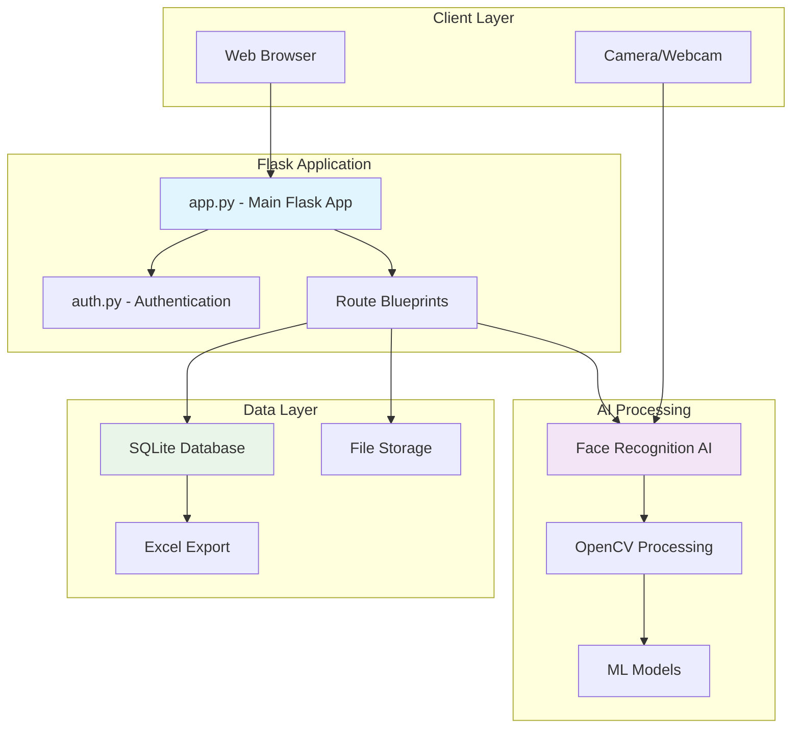

### 🔄 System Initialization Flow

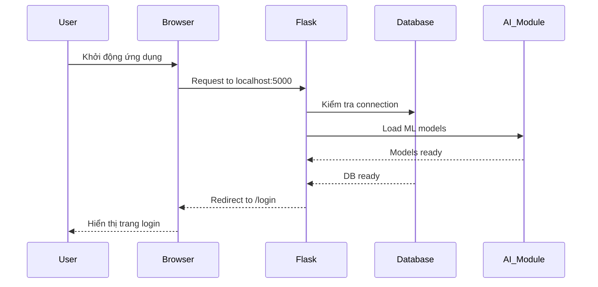

---

## 👤 Luồng Người dùng

### 🚪 User Journey - Toàn bộ quy trình

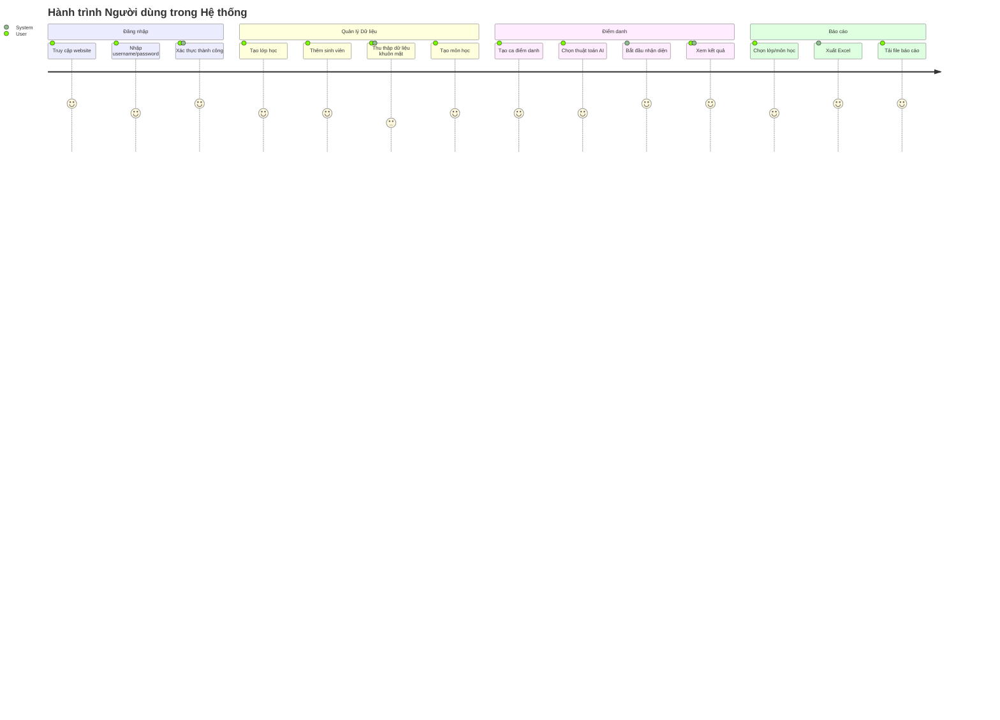

### 🎯 Main User Workflows

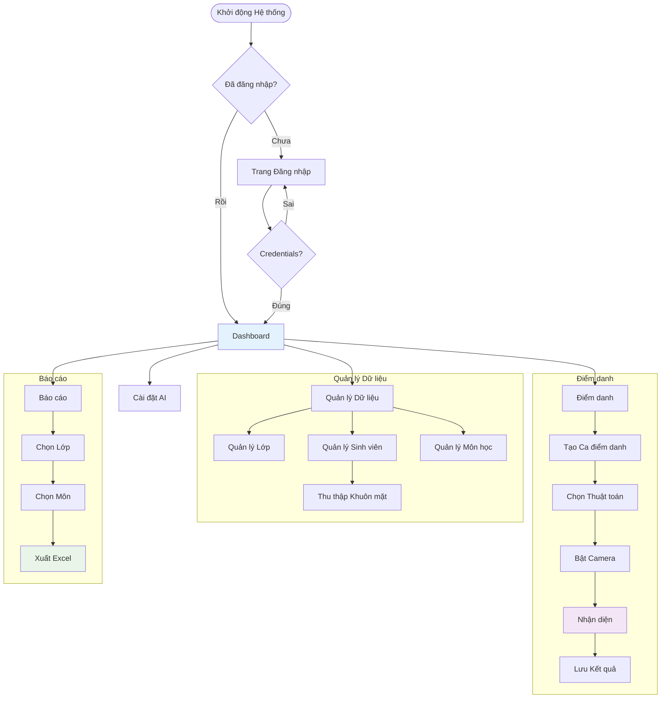

---

## 🔐 Authentication Flow

### 🛡️ Security và Session Management

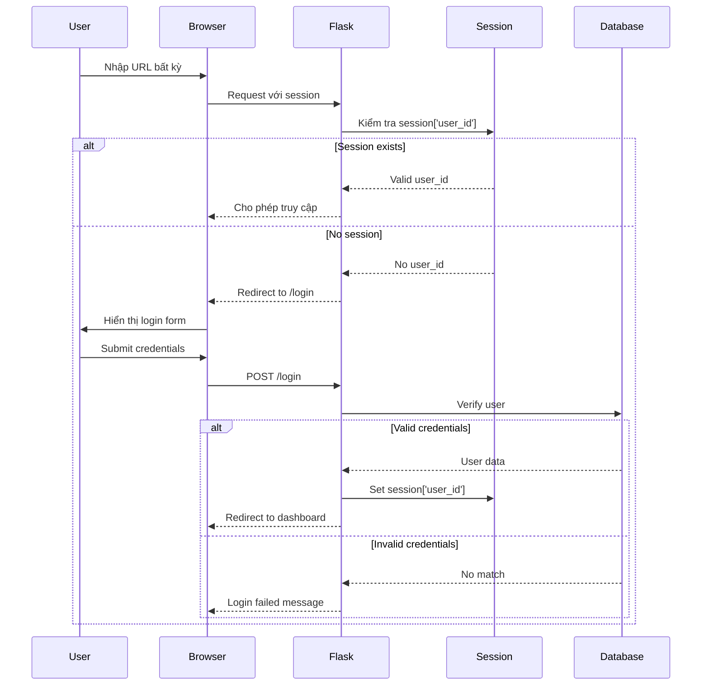

### 🔒 Route Protection Pattern

```mermaid
graph LR
    REQUEST[HTTP Request] --> CHECK{@login_required?}
    CHECK -->|Yes| SESSION{Session exists?}
    CHECK -->|No| ALLOW[Allow Access]
    
    SESSION -->|Yes| ROUTE[Execute Route]
    SESSION -->|No| LOGIN[Redirect to Login]
    
    ROUTE --> RESPONSE[Return Response]
    LOGIN --> AUTH_PAGE[Login Page]
    
    style SESSION fill:#fff3e0
    style LOGIN fill:#ffebee
    style ROUTE fill:#e8f5e8
```

---

## 🤖 Face Recognition Pipeline

### 🎥 Real-time Recognition Flow

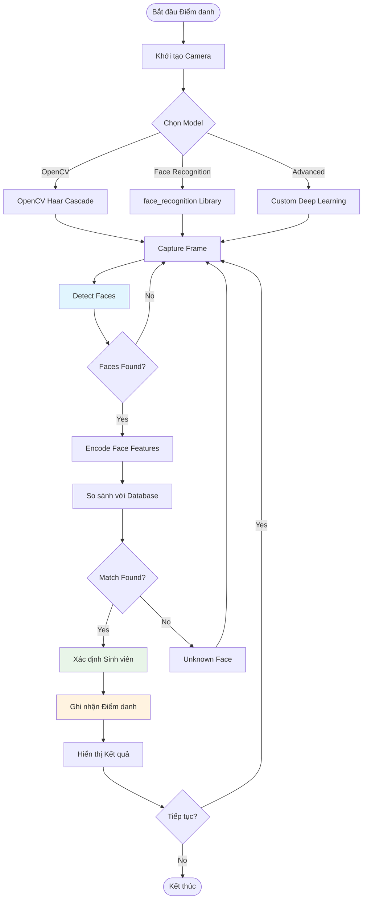

### 🧠 AI Model Comparison

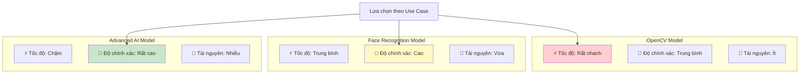

---

## 🗄️ Database Flow

### 📊 Database Schema Relationships

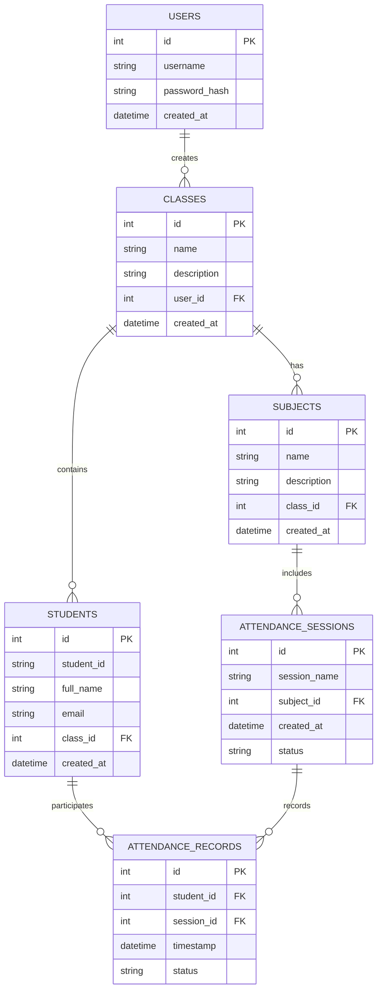

### 💾 Data Processing Flow

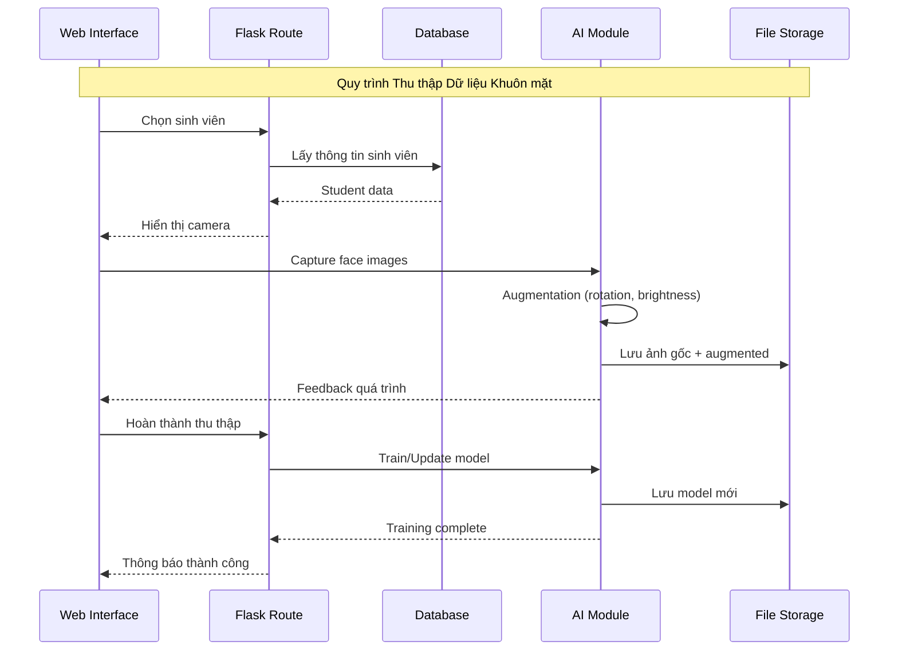

---

## 📈 Performance Metrics

### ⚡ Response Time Analysis

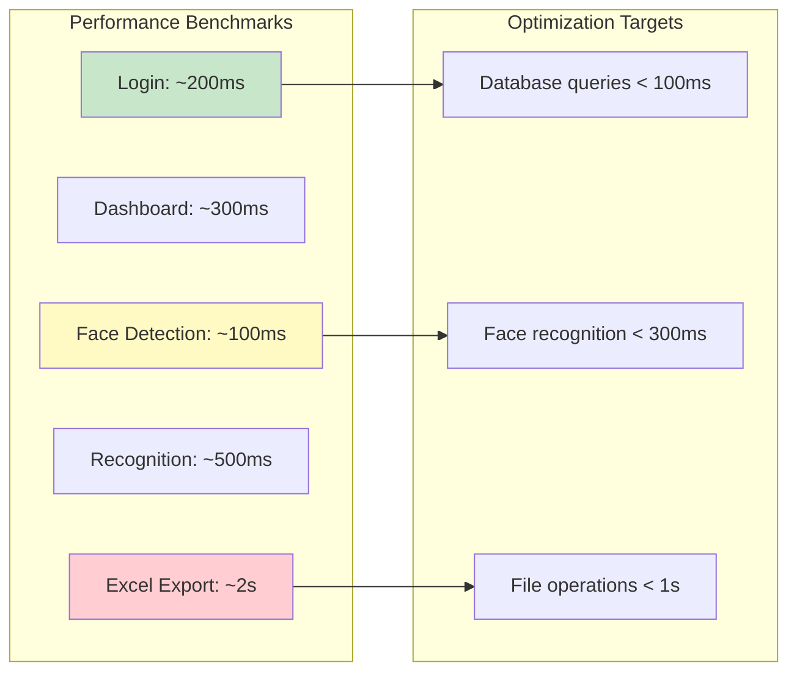

### 🔍 Accuracy Metrics

| Model | Speed | Accuracy | Resource Usage | Best Use Case |
|-------|-------|----------|----------------|---------------|
| OpenCV | ⭐⭐⭐⭐⭐ | ⭐⭐⭐ | ⭐⭐ | Demo, Testing |
| Face Recognition | ⭐⭐⭐⭐ | ⭐⭐⭐⭐ | ⭐⭐⭐ | Production |
| Advanced AI | ⭐⭐ | ⭐⭐⭐⭐⭐ | ⭐⭐⭐⭐⭐ | High Security |

---

## 🚨 Error Handling

### 🛠️ Troubleshooting Flowchart

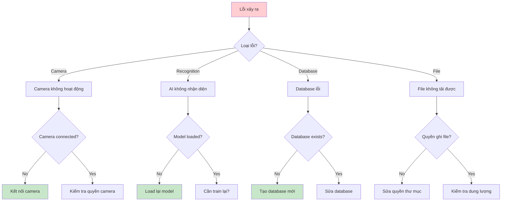

### 🔧 Common Issues & Solutions

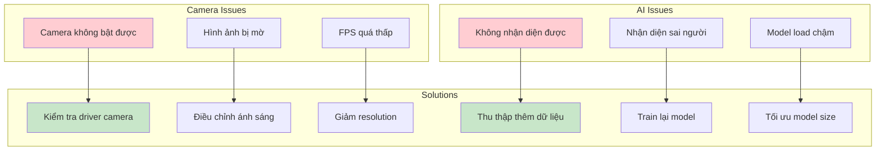

### 📋 Troubleshooting Guide

| Lỗi | Triệu chứng | Nguyên nhân | Giải pháp |
|-----|-------------|-------------|-----------|
| 📷 **Camera không hoạt động** | Màn hình đen, không có video | Browser chưa cấp quyền | Vào Settings → Privacy → Camera → Allow |
| 🧠 **Không nhận diện được** | "Không tìm thấy sinh viên" | Chưa thu thập đủ dữ liệu | Thu thập thêm 10-15 ảnh khuôn mặt |
| 📊 **Xuất Excel lỗi** | File không tải về | Lỗi permissions | Tạo thư mục `exports` với quyền write |
| 🗄️ **Database locked** | "Database is locked" | Nhiều connections | Restart server, đóng tất cả connections |
| 🌐 **Server không phản hồi** | Trang trắng/timeout | Server crash | Restart bằng `python app.py` |

---

## 📊 System Monitoring

### 📈 Real-time Dashboard Metrics

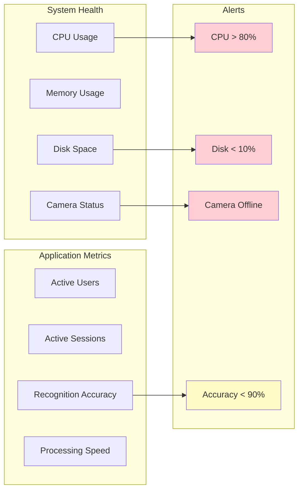

### ⏱️ Performance Timeline

```mermaid
gantt
    title Thời gian xử lý các tác vụ hệ thống
    dateFormat X
    axisFormat %L ms
    
    section Authentication
    Login process: 0, 200
    Session check: 0, 50
    
    section Face Recognition
    Camera init: 0, 300
    Face detection: 0, 100
    Face recognition: 0, 500
    
    section Data Operations
    Database query: 0, 50
    Excel export: 0, 2000
    Model training: 0, 10000
```

---

## 🎯 Conclusion

Hệ thống điểm danh khuôn mặt được thiết kế với kiến trúc modular, dễ bảo trì và mở rộng. Luồng hoạt động được tối ưu để đảm bảo hiệu suất cao và trải nghiệm người dùng mượt mà.

### 🔑 Key Benefits

1. **🚀 High Performance**: Xử lý real-time với multiple AI models
2. **🔒 Secure**: Session-based authentication với route protection
3. **📱 Responsive**: Mobile-friendly interface
4. **📊 Analytics**: Comprehensive reporting và export capabilities
5. **🛠️ Maintainable**: Clean code structure với detailed documentation

### 🎯 Future Enhancements

- [ ] API REST cho mobile app
- [ ] Cloud deployment support
- [ ] Advanced analytics dashboard
- [ ] Multi-tenant support
- [ ] Real-time notifications
- [ ] Integration với hệ thống LMS

---

*📝 Document được cập nhật thường xuyên để phản ánh các thay đổi trong hệ thống.*
